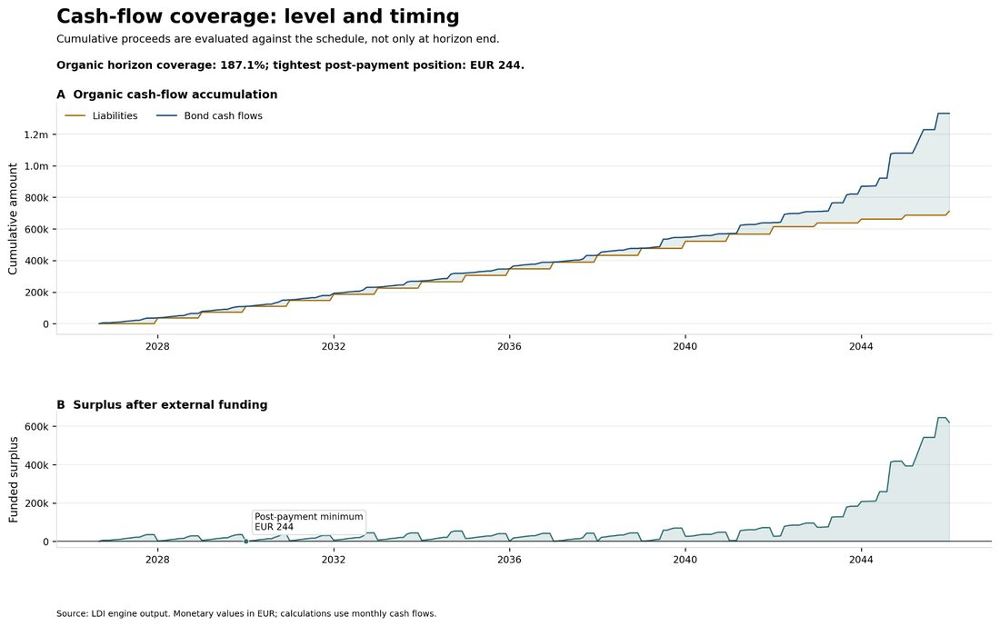
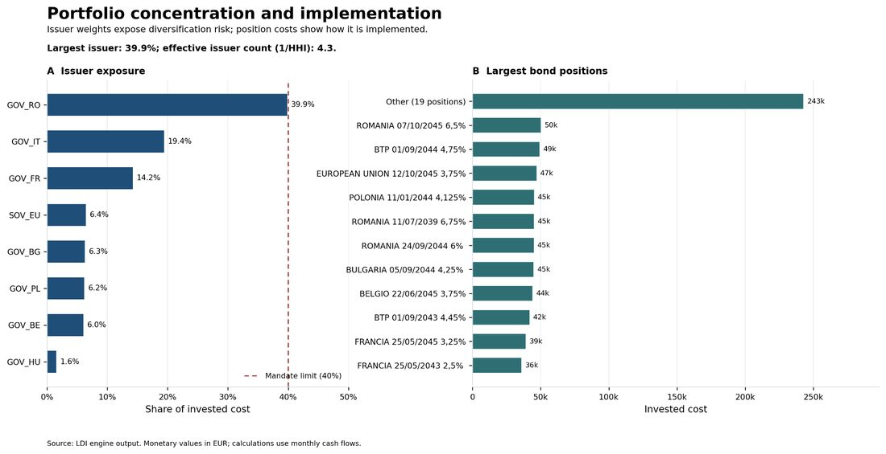
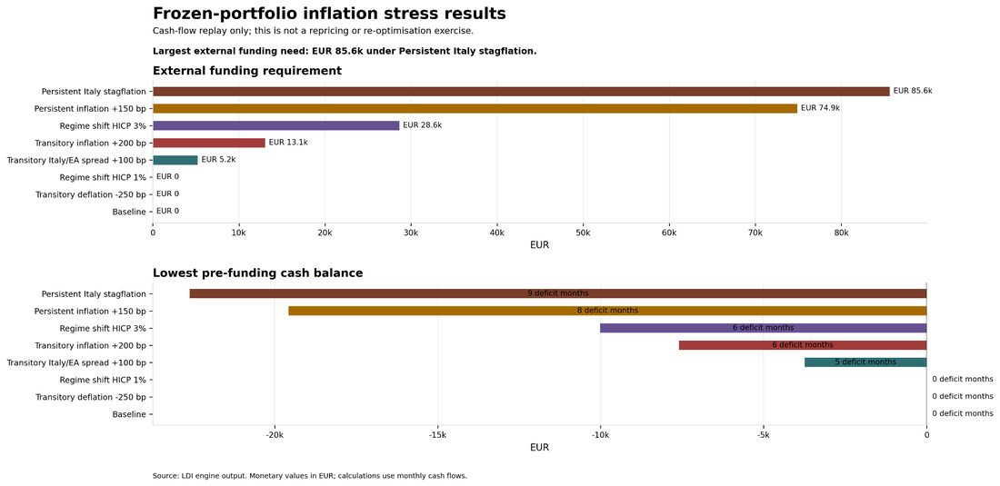

# LDI Cash-Flow Matching

Python workflow to build a bond portfolio that covers a schedule of future monthly liabilities. The project downloads official and market data, validates them, builds cash flows, solves a MILP problem, and produces Excel reports and auditable Parquet outputs. Charts are generated only through the dedicated plotting entry point.

The project is designed for scheduled batch execution. `main.py` remains available as an interactive entry point; for operational runs, use `scripts/run_ldi.py`.

## Sample Outputs

The charts below show representative outputs generated by `plot.py` from a completed optimization run.



*Cash-flow coverage and funded surplus across the liability horizon.*



*Issuer concentration and largest bond positions used to implement the matched portfolio.*



*Frozen-portfolio stress replay showing external funding needs under deterministic inflation scenarios.*

---

## Architecture

```text
Scheduler
    |
    v
scripts/run_ldi.py
    |
    +-- exclusive anti-concurrency lock
    +-- execution manifest
    +-- main.py
           |
           +-- external data ingestion
           |     +-- bond market data
           |     +-- ECB Svensson curve
           |     +-- ISTAT FOI
           |     +-- Eurostat HICP
           |
           +-- validation and cleaning
           +-- cash-flow generation
           +-- MILP cash-flow matching
           +-- stress tests and Excel report
```

Chart generation is separated from the standard pipeline and must be started explicitly through `plot.py`.

Downloaders share operational primitives in `core/ingestion_support.py`:

- HTTP retries with exponential backoff for transient errors;
- explicit timeouts;
- atomic Parquet writes through temporary files and replacement;
- no publication of partial files.

The lock is written to `data/processed/.ldi-run.lock`. The latest execution manifest is `data/processed/run_manifest.json` and stores status, timestamps, host, process, duration, completed stages and any error.

## Installation

Use Python 3.11 or higher in a virtual environment:

```powershell
python -m venv .venv
.\.venv\Scripts\Activate.ps1
python -m pip install --upgrade pip
python -m pip install -r requirements-dev.txt
```

## Operational Run

From PowerShell, at the repository root:

```powershell
python scripts/run_ldi.py
```

The command:

1. prevents concurrent executions;
2. reuses today's archived bond snapshot, or downloads a new pair of files;
3. uses the FOI/HICP cache if it is valid, monthly, gap-free, positive and no more than two months old;
4. updates missing or invalid indices;
5. rebuilds all derived artifacts;
6. produces the report and updates the manifest.

For interactive use, you can still run:

```powershell
python main.py
```

This mode does not add the lock or manifest; for a scheduled job, always use `scripts/run_ldi.py`.

## Local Web App

The web app is an adapter for the batch pipeline, not a second implementation of the model. The **Run Full Pipeline** button starts the same operational contract used by the scheduler in a separate process: `execute_with_manifest(main)`. As a result, it produces the same snapshots, Parquet files, manifest, stress tests and Excel reports.

Start locally with the Waitress WSGI server:

```powershell
$env:LDI_WEB_HOST="127.0.0.1"
$env:LDI_WEB_BROWSER_HOST="127.0.0.1"
python -m Webapp.server
```

With the configuration above, the server automatically opens Google Chrome at `http://127.0.0.1:5000/`. Host and port can be changed through `LDI_WEB_HOST` and `LDI_WEB_PORT`; to use a different browser host, set `LDI_WEB_BROWSER_HOST`. Automatic browser launch can be disabled with `LDI_WEB_OPEN_BROWSER=0`.

Each web execution has a persistent identifier and a dedicated directory:

```text
data/webapp/
|-- runs.sqlite3
|-- config_history/
`-- runs/<web_run_id>/
    |-- request.json
    |-- execution.log
    `-- artifacts/
```

SQLite stores operational state; DataFrames and results remain in Parquet. The web process does not duplicate downloads, taxation logic, solver logic or stress tests. The global pipeline lock also prevents overlap between a web run and a run started from Visual Studio or the scheduler.

Liabilities, scenarios and UI-exposed parameters can be edited after validation. The web profile is saved separately and each run archives the exact parameter snapshot used. `Universe Filters` remains read-only and continues to use the canonical pipeline universe. Direct execution of `main.py` keeps the project's default values.

## Recommended Scheduling

On Windows, use Task Scheduler with:

- program: absolute path to the Python executable in the virtual environment;
- arguments: `scripts/run_ldi.py`;
- start directory: absolute repository root;
- frequency: daily on business days, preferably after official data availability;
- execution under a dedicated technical account;
- stdout/stderr logging to an operating-system-managed file;
- alerting if the process returns a non-zero exit code.

Example:

```text
Program: C:\path\to\LDI\.venv\Scripts\python.exe
Arguments: C:\path\to\LDI\scripts\run_ldi.py
Start in: C:\path\to\LDI
```

On Linux or in containers, use the same command through cron, a systemd timer or an orchestrator such as Prefect or Dagster. The ingestion code is idempotent and can be moved into a containerized job without changing the LDI domain logic.

## Data Sources

| Dataset | Source | Destination |
|---|---|---|
| Bond market | SimpleTools for Investors | `data/raw/bonds/fd_YYYYMMDD.parquet`, `bi_YYYYMMDD.parquet` |
| Svensson curve | ECB Data API | `data/raw/curves/yc_YYYYMMDD.parquet` |
| FOI excluding tobacco | ISTAT SDMX + Rivaluta | `data/foi_xt_it.parquet` |
| HICP excluding tobacco | Eurostat | `data/hicp_xt_ea.parquet` |

External data are validated before publication. FOI and HICP sources are also checked for positivity, monthly dates and time continuity. The historical ISTAT endpoint is parameterized on the latest complete month, not on a hardcoded date.

### Historical Bond Archive

Each bond download generates an immutable pair of Parquet files in `data/raw/bonds/`:

```text
fd_YYYYMMDD.parquet    # end-of-day data
bi_YYYYMMDD.parquet    # bond reference data
```

`YYYYMMDD` is the archive date, not a date inferred from market content. During a new run, the pipeline first checks today's pair: if present and schema-valid, it is reused without calling the website. If the pair is missing, the pipeline downloads the files and creates only new snapshots, never overwriting historical ones.

If the download fails, the pipeline may use the latest complete pair within five days. The fallback is written to the logs; beyond that threshold, the job fails explicitly to avoid building a portfolio with stale data.

### Historical ECB Curve Archive

Svensson curves follow the same policy in `data/raw/curves/`:

```text
yc_YYYYMMDD.parquet
```

The pipeline reuses today's archived curve if it is valid; otherwise, it downloads a new one. If the ECB Data API fails, it may use the latest valid curve within five days; otherwise, the job stops. Valuation utilities automatically read the latest valid curve snapshot, while remaining compatible with the old `data/raw/ecb_svensson.parquet` file if it still exists.

## Liability Policy

Dates configured in `data/config/liabilities.json` follow an explicit inclusive policy: `end_date` identifies the final annual liability to pay. The `LIABILITY_PAYMENT_TIMING` parameter in `core/utils.py` can be `period_start` or `period_end`. Contractual dates are used for FOI indexation; matching remains aggregated at the payment-month level.

## Outputs

Charts are not part of `main.py`, the scheduler or web runs. To run the workflow and generate charts explicitly:

```powershell
python plot.py
```

Generated artifacts are local and should not be committed:

- `data/processed/ldi_optimization.xlsx` - Excel report;
- `data/processed/bond_cashflows.parquet` - detailed cash flows;
- `data/processed/bond_cashflow_matrix.parquet` - monthly cash-flow matrix;
- `data/processed/inflation_baseline.parquet` - FOI/HICP baseline;
- `data/processed/inflation_stress_*.parquet` - stress-test audit files;
- `data/processed/plots/` - charts;
- `data/processed/run_manifest.json` - latest execution outcome.

Temporary files and raw data remain excluded from Git through `.gitignore`.

## Run Reproducibility

Each operational run receives a `run_id`. The current manifest is written to `data/processed/run_manifest.json`; an immutable historical copy is saved in `data/processed/run_manifests/`. The manifest records SHA-256 hashes and metadata for inputs and outputs, the snapshots actually used, JSON configurations, Git commit, Python version, fallbacks, warnings and quantitative solver results. Archived raw snapshots and hashes make it possible to reconstruct a result without relying on derived files that may be overwritten by a later run.

## Quality and CI

Local checks:

```powershell
python -m ruff format . --check
python -m ruff check .
python -m unittest discover -s tests -v
```

GitHub CI runs the same checks in a clean environment. Tests are deterministic and do not require network access; a full execution of `scripts/run_ldi.py` requires network access and available official data sources.

## Operations and Incidents

If the job fails:

1. inspect `data/processed/run_manifest.json`;
2. check the Task Scheduler log;
3. verify that `.ldi-run.lock` does not belong to an active process;
4. remove the lock only after confirming that it is stale;
5. rerun the job.

A failed run does not replace previously valid datasets: atomic writes preserve the latest complete output available.

## Main Structure

```text
core/                         domain logic, pipeline and orchestration
scripts/downloaders/          external data acquisition
scripts/cleaners/             bond universe cleaning
scripts/run_ldi.py            scheduler entry point
data/config/                  versioned contractual configuration
data/raw/                     local raw inputs, not versioned
data/processed/               derived outputs, not versioned
tests/                        unit and contract tests
Webapp/                       UI, API and isolated pipeline adapter
```

The domain remains a financial batch pipeline with auditable outputs; the web app is a LAN interface. Before exposing it outside a trusted network or to multiple users, authentication, TLS, authorization, external backups and alerting should be added.
